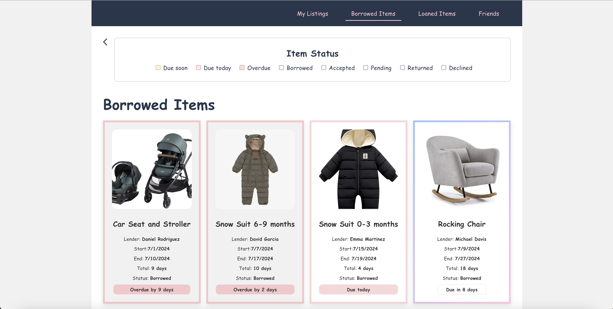
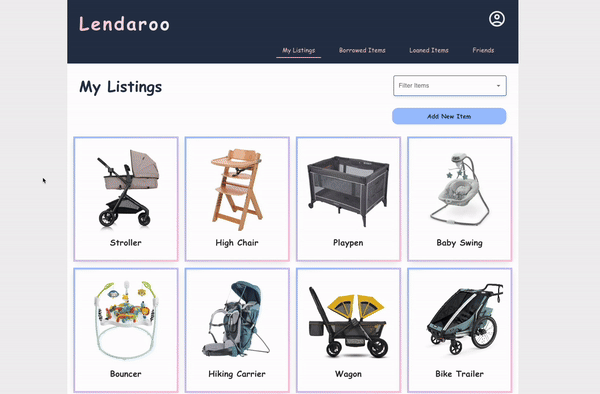
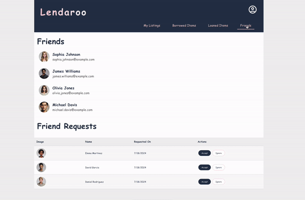

# Lendaroo

Lendaroo is a borrow/lend platform for parents to share essential, high-value baby gear, helping reduce consumption and expenses during the early stages of parenthood.



### 🤔 Why Lendaroo?

The early stages of parenthood come with significant expenses for items that are often needed for only a short time. While many of these items are gently used and ideal for sharing, finding a reliable and convenient way to do so can be difficult. Lendaroo solves this by creating a platform for parents to lend and borrow essential baby gear within a trusted community. By facilitating the sharing of these items, Lendaroo helps families save money, reduce consumption, and minimize waste, easing financial pressure and promoting sustainable, eco-friendly living.

### 👪 Who Should Use Lendaroo?

Lendaroo is for parents and caregivers of young children who want to borrow or lend high-value baby and toddler items within a trusted community of friends and family.

### 🌟 Features

- As a user, I want to list items I am willing to lend so that others can see what is available.
- As a user, I want to upload photos and descriptions of items I am lending so that others can understand the condition and features of the items.
- As a user, I want to browse available items so that I can find what I need.
- As a user, I want to request to borrow an item so that I can use it for a period of time.
- As a user, I want to receive and manage borrowing requests so that I can decide who can borrow my items.
- As a user, I want to track who has borrowed my items and when they are due back so that I can ensure they are returned.

### 🎬 Demo





## Implementation

### 🖥️ Tech Stack

- React.js (with React Router)
- SASS
- Material UI
- Node.js
- Express.js
- Axios
- Knex.js
- MySQL

### 🗺️ Sitemap

- Lend Items
- Friends List
- Item Details
  - Upload Item
  - Edit Item
  - Delete Item
- Request Item

## 📡 API Endpoints

### Borrow Requests

- `GET    /` – Get all borrow requests
- `GET    /borrower/:userId` – Get borrow requests by borrower
- `GET    /lender/:userId` – Get borrow requests by lender
- `GET    /item/:itemId` – Get borrow requests for a specific item
- `GET    /:requestId` – Get a specific borrow request by ID
- `GET    /status/:statusId` – Get borrow requests by status
- `POST   /` – Create a new borrow request
- `PUT    /:requestId` – Update a borrow request
- `DELETE /:requestId` – Delete a borrow request

### Items

- `POST   /` – Create a new item (with image upload)
- `GET    /` – Get all items
- `GET    /item-types` – Get all item types
- `GET    /user/:userId` – Get items by user and status
- `GET    /:itemId` – Get an item by ID
- `PUT    /:itemId` – Update an item by ID (with image upload)
- `PUT    /:itemId/status` – Update the status of an item
- `DELETE /:itemId` – Delete an item

### Friends

- `GET    /:requestId` – Get a user relationship by ID
- `GET    /:userId/all` – Get all friends for a user
- `GET    /pending/:userId` – Get all pending friend requests for a user
- `POST   /` – Create a friend request
- `PUT    /:requestId` – Update the status of a friend request
- `DELETE /:requestId` – Delete a friend request (consider adding a "cancelled" state)

### User Management

- `POST   /register` – Register a new user
- `POST   /login` – Log in a user
- `GET    /profile` – Get the logged-in user's profile (authentication required)
- `GET    /:userId` – Get a user by ID
- `GET    /:userId/items` – Get all items by a user

## 🚀 Future Development and Implementation Plan

- Create **Register** page
- Create **Login** page
- Create a **Profile/Dashboard** page
- Implement **user authentication and authorization**
- Enable **user search**, friend request sending, and accepting
- Facilitate **communication between lenders and borrowers**
- Manage **lending periods** and send reminders for returns
- Add an **item category for gifting** and related functionality

## 💻 Local Installation

### Prerequisites

Before you begin, ensure you have the following installed on your machine:

- Node.js (v14 or later) and npm
- MySQL installed and running locally
- Git

### 🔗 Repository Links

- **Client:** [https://github.com/jsavkovic/jasmina-savkovic-capstone-client](https://github.com/jsavkovic/jasmina-savkovic-capstone-client)
- **Server:** [https://github.com/jsavkovic/jasmina-savkovic-capstone-server](https://github.com/jsavkovic/jasmina-savkovic-capstone-server)

### Server Setup (Backend)

1. **Clone or download** the [Server Repository](https://github.com/jsavkovic/jasmina-savkovic-capstone-server).

2. **Install dependencies:**

   ```
   npm install
   ```

3. **Set up the MySQL database:**

   - Create a new database.
   - Create a new MySQL user and grant privileges.

4. **Configure `.env` file:**

   ```
   PORT=<PORT>
   DB_HOST=127.0.0.1
   DB_LOCAL_DBNAME=<YOUR_DB_NAME>
   DB_LOCAL_USER=<YOUR_DB_USER>
   DB_LOCAL_PASSWORD=<YOUR_DB_PASSWORD>
   ```

5. **Run migrations:**

   ```
   npx knex migrate:latest
   ```

6. **Run seed files:**

   ```
   node db/run_seeds.js
   ```

7. **Start the server:**

   ```
   npm start
   ```

### Client Setup

1. **Clone or download** the [Client Repository](https://github.com/jsavkovic/jasmina-savkovic-capstone-client).

2. **Install dependencies:**

   ```
   npm install
   ```

3. **Configure `.env` file:**

   ```
   VITE_API_URL=http://localhost:<PORT>
   ```

4. **Start the client:**

   ```
   npm run dev
   ```

### 🤝 Contributing

If you'd like to contribute to the Lendaroo project, please fork the repository and submit a pull request with your changes.

### 🚧 Work in Progress

This app is currently under active development. Features are being continuously added and refined, so expect updates and new functionality regularly.

